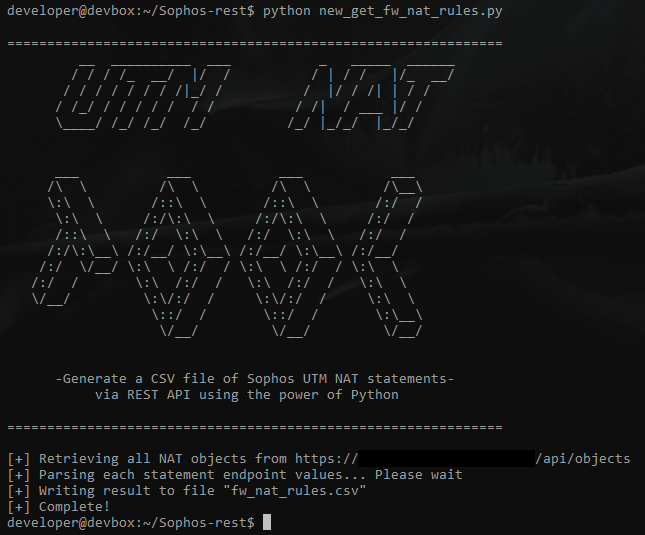

# sophos-utm

get_fw_nat_rules.py uses the rest API of sophos UTM firewalls to generate a CSV file of the NAT statements present on the firewall.

- common_bits.py contains the authorization token information and common functions used by the other files
- nat_services.py contains functions to retrieve and parse data from endpoints in api/objects/services
- nat_network.py contains functions to retrive and parse data from endpoints in api/objects/network

To use, edit common_bits.py to include the api URL and authorization token and run get_fw_nat_rules.py

